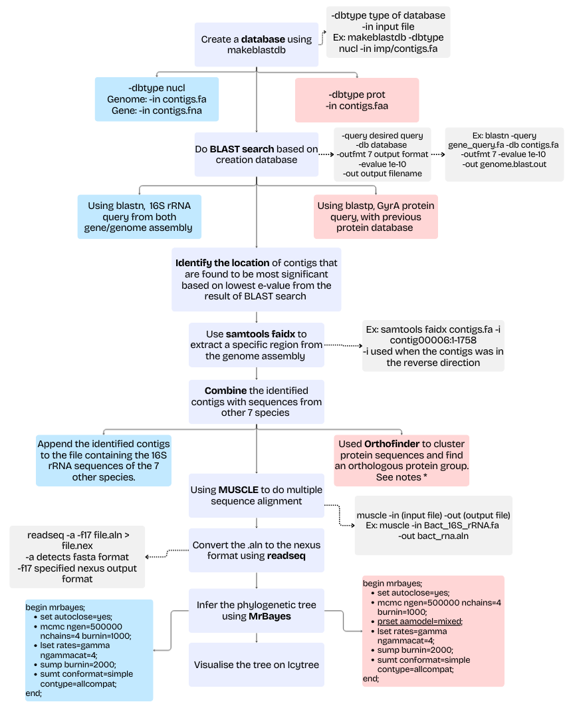
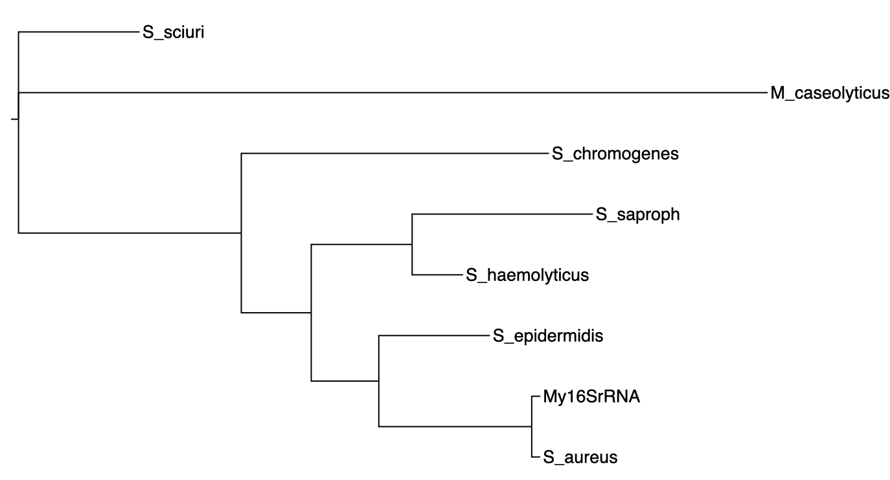
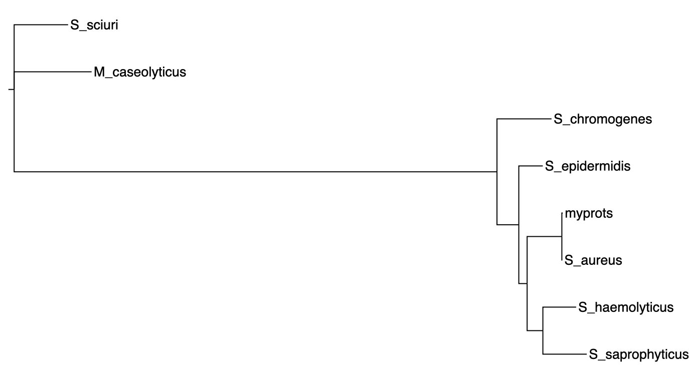

# De Novo Genome Assembly

De novo genome assembly is the process of reconstructing an organism's genome from scratch by assembling short DNA sequencing reads into longer contiguous sequences (contigs) and scaffolds without a pre-existing reference. 

There were few methods to do De novo genome assembly, in here we utilized de bruijn graph methods. 

It takes paired-end sequencing reads as input and outputs the assembled genome. The SRR14457241 dataset were used for assembly from ENA database - detected as bacterial genome.

# Pipeline
## Genome Assembly 
The assembly were done using shovill. 
```bash
shovill --outdir ../ASSEMBLY --R1 SRR14457241.fastq.gz --R2 SRR14457241.fastq.gz
```

## A/B gene initio prediction
The assembly were done using prodigal. 

```bash
# AB initio gene prediction with Prodigal
prodigal -a contigs.prot.faa -c -d contigs.cds.fna -f gff -g 11 -i
contigs.fa -o contigs.gff 
# -a : output protein translations
# -c : closed ends (circular)
# -d : nucleotide sequences of genes
# -f : output format (gff)
# -g : genetic code (11 for bacteria)
# -i : input contig file
# -o : output file for gene coordinates
# contigs.fa : input contig file from shovill assembly
```

## Phylogenetics analysis
There were two main analyses in this process. Firstly, it was phylogenetics analyses using the protein sequences and, secondly, using nucleotides sequences.

In here, we utilised two marker genes:
- 16S → gold standard marker for bacterial identification
- gyrA → build higher-resolution phylogeny
These marker genes were used to determine the taxonomic placement of our isolate and to infer its evolutionary relationship with closely related species.

During the phylogenetic analyses, our sequences were compared with those from 7 other species to assess genetic relatedness and to construct phylogenetic trees illustrating their evolutionary relationships.

Please refers to flow chart below:

General workflow of creating phylogenomic tree from assembly genomes. Purple coloured
the general guidelines, blue box indicates the methods specific for gene/genome or 16S rRNA
sequence set, pink box representing methods specific for gyrA protein set, grey box with dashed
arrows is notes for specific methods.

The process required exploratory analyses in your own terminal. 

# Result
This is the result for our phylogenetics analyses for 16sRNA


Result for gyrA:


The main similarity between the 16S rRNA and gyrA phylogenetic trees is that both place our
sequence closest to *S. aureus*. This suggests that the assembled genome is closely related to *S. aureus*,
or that the compared genes are homologous to *S. aureus*.