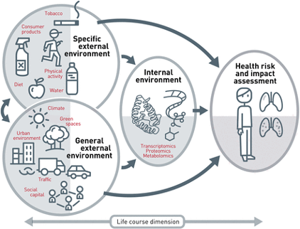
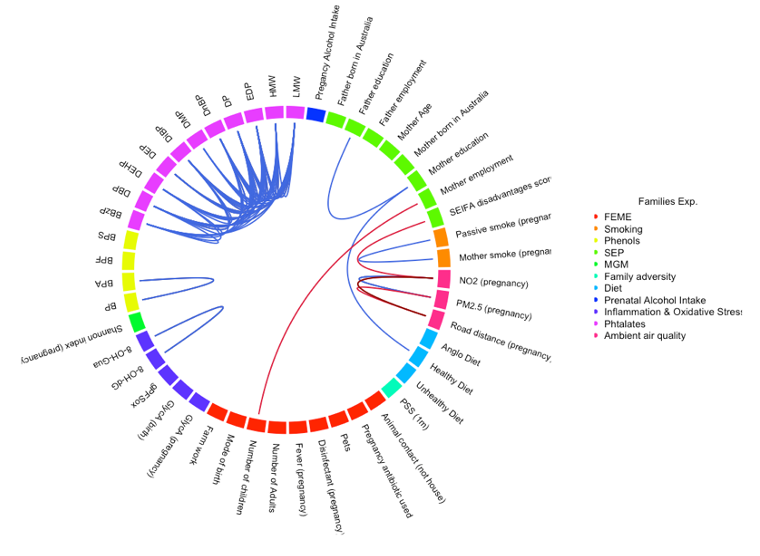
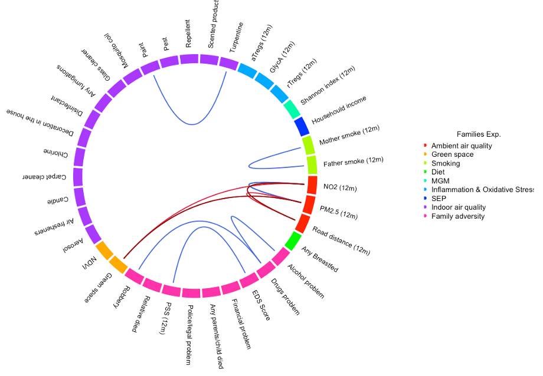
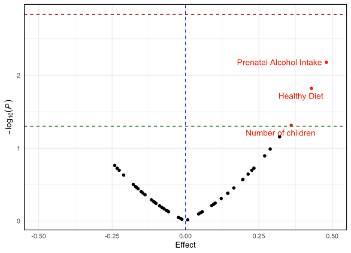
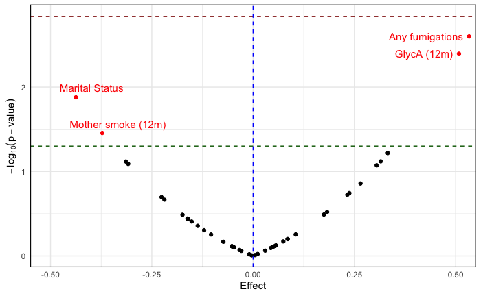
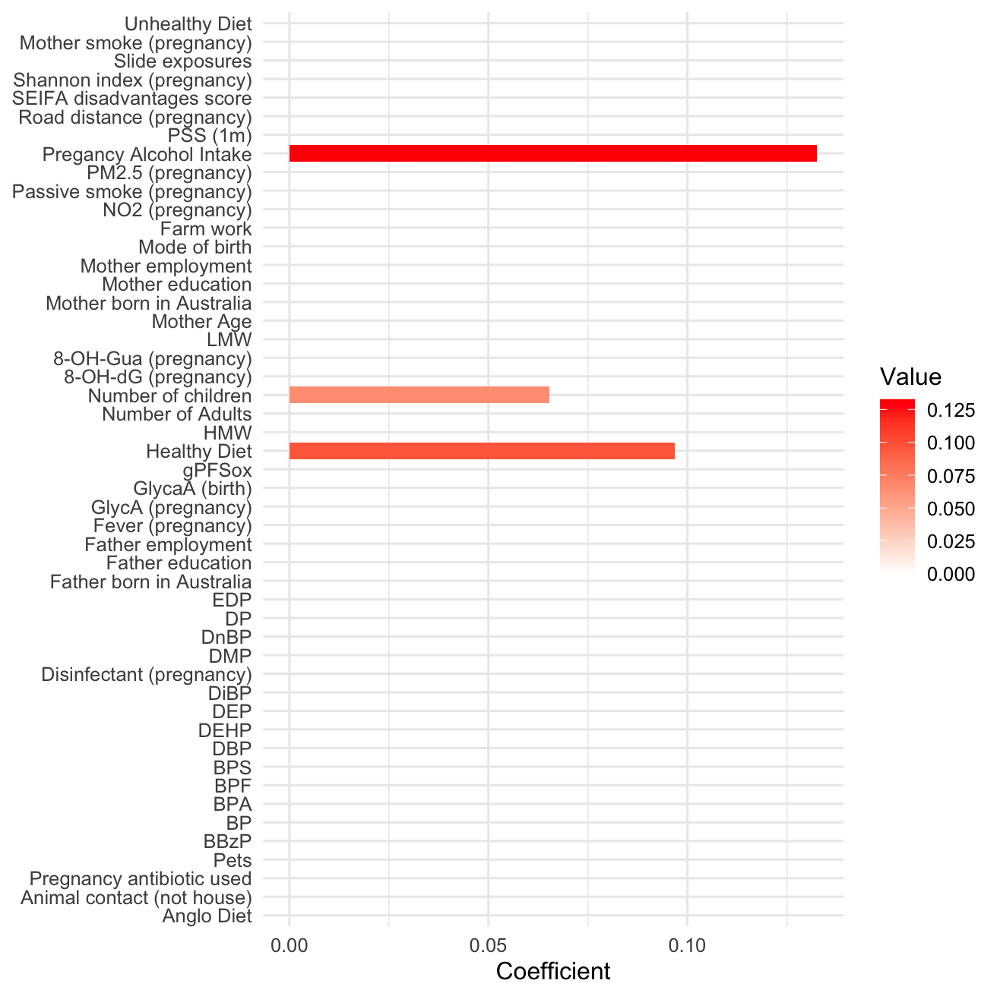
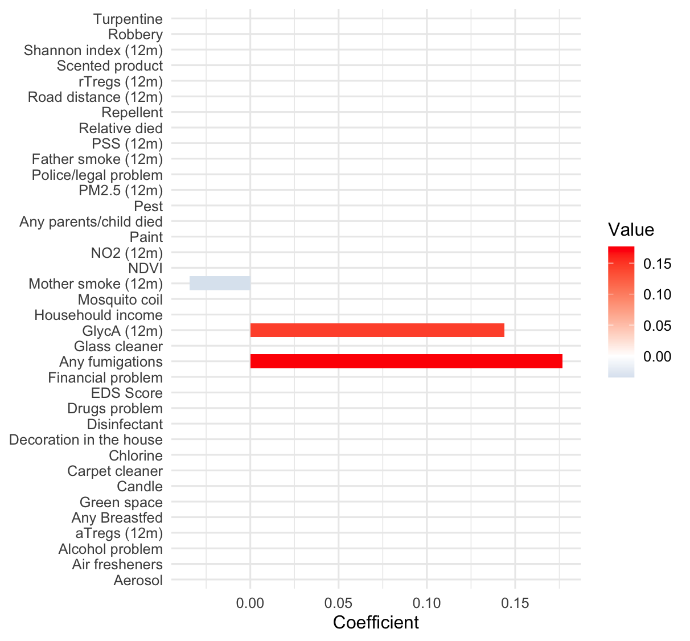
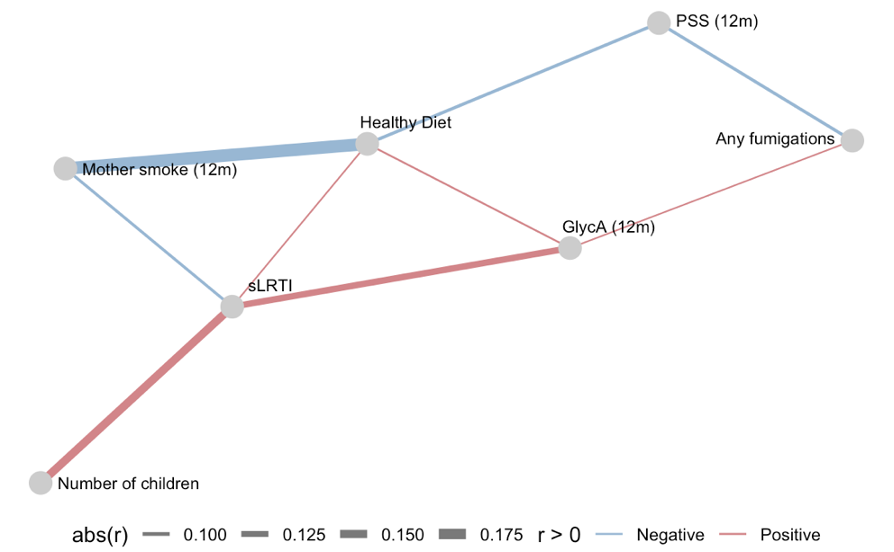
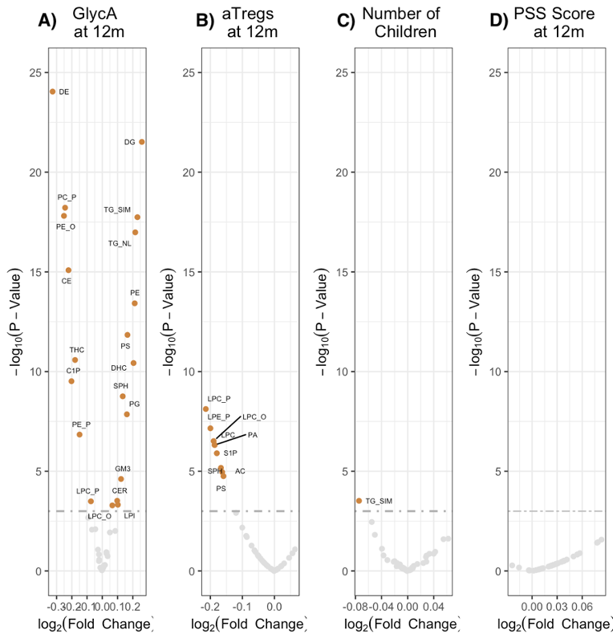
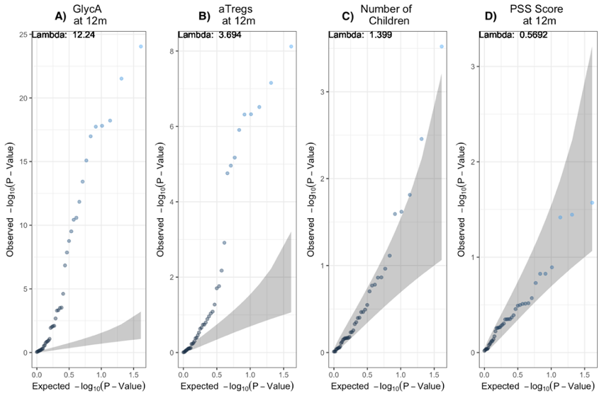

# Exposome on Children Severe Lower Respiratory Illnesses

# Introduction
This project analysed the exposome (the total of external exposures that have been exposed during their lifespan) and its relation to Severe Lower Respiratory Illnesses in Children. The sLRTI examples are asthma, bronchitis, and pneumonia. There were 697 mother-infant pairs and 85+ exposures during prenatal and postnatal (until the children reached 12 months).

In Exposome, we required a highly multidimensional data to discovered the connection between the exposures and the participants. The project also contain the lipidomics data with at least 41 lipids included in this analyses.

Credit: Virjheid, 2014

This project utilized data from the Barwon Infant Study. Due to privacy reason, I can't show you the data and some of the data cleaning process. However, I aided some pictures. 

# Analyses
The analysis mostly used **R package rexposome** (look at main.tex for ). This project separated  postnatal and prenatal exposures. 

Refers to this diagram for the general overview of the analyses:

Statistical framework for the exposome data analysis. Green colour specifically used for prenatal data, blue colour analysis for postnatal data, and grey colours were using both prenatal and postnatal data. The purple colour only using specific variables that selected from previous analysis. 
- PCA is principal component analysis; ExWAS is Exposome-wide association studies; InExWAS is inverse ExWAS; MExWAS is multivariable ExWAS; DSA is deletion-substitution-addition algorithm; sLRTI is severe lower respiratory tract illnesses.

Explanation of analysis:
- Data pre-processing:
    - Removal of participant or highly missing exposure (>70% missingness)
    - PMM imputations using MICE package
    - Normalisation 
    - Yeo-johnson transformation since the exposure combine the clinical and biological data
- Data identification:
    -  PCA to explore the variations between variables and families
    - Pearsons correlation were applied to identify the relationship between intra-family and inter-family exposures.
- ExWAS:
    - Exposome-wide association studies using linear regression
    - InExWAS is inverse ExWAS to do reverse linear regression where it fitted the exposures as the outcome (Y), while the actual outcome as the predictor (X) in a linear regression mode
    - MExWAS is multivariable ExWAS using elastic net regression.
- DSA: iterative linear regression search method that can remove, substitute, and add a term to the model. DSA automatically search for the best combination among variables and interactions between variables to predict an outcome, which can outperform ExWAS
- Partial correlations: Useful to understand the complex relationship and reduce the misleading results through controlling the confounding relationship

# Result 
In total, there were at least 15 figures in this report. However, I only presented the main findings. Please email me through vicsjalim@gmail.com for more information.

## Correlations 
- Prenatal 

Correlations between pre-natal exposures plot it in the circos diagram. The color of the outer rings indicated the family of the exposures. The link depicted a correlation between the exposures, while the colour blue indicates positive correlation (rho >0.3), while the colour red depicted negative correlations (rho<-0.3). 

- Postnatal

Correlations between postnatal exposures plot it in the circos diagram. The color of the outer rings indicated the family of the exposures. The link depicted a correlation between the exposures, while the colour blue indicates positive correlation (rho >0.3), while the colour red depicted negative correlations (rho<-0.3). 

## ExWAS

| Method | Prenatal | Postnatal |
|-------|--------|-------|
| ExWAS | |  |
| MExWAS |  |  | 

## Partial Correlations 
From previous analyses, we made a 

The network graph for partial correlations analysis. The red line shows positive associations between variables and the blue line shows negative correlations. Each node representing the exposures or the outcome. Thickness of the line describes the stronger associations with highest r= 0.175 and lowest is r = 0.10. The exposures chosen by p-value < 0.05. 

## Associations analysis
The aims of association analysis were to determine which exposures strongly correlated with several lipid classes and, secondly, to determine whether the exposures that were found significant in ExWAS analysis were associated with the lipids. 

Volcano plots showing plasma lipid responses at 12 months to selected exposures: (A) GlycA at 12 months, (B) aTregs (activated T Regs) at 12 months, (C) number of children, and (D) Maternal perceived stress score (PSS) at 12 months. The dashed horizontal line indicates the significance threshold (p = 0.001). Lipids passing this threshold with log2(fold change) > 0 are considered significantly positive association (orange), while those with log2(fold change) < 0 are significantly negative association (orange). 

Quantiles-Quantiles (QQ) plot for lipids on selected exposures: (A) GlycA (12m), (B) aTregs (activated T Regs) at 12 months, (C) number of children, and (D) Maternal perceived stress score (PSS) at 12 months. The x-axis represents the expected -log10(p-value), and y-axis represents observed -log10(p-value). The scatter point represents each lipids point. The grey shaded area depicted 95% confidence interval of the expected null distribution of p-values. Lambda on the top left corner indicated the inflation or deflation factor. 

